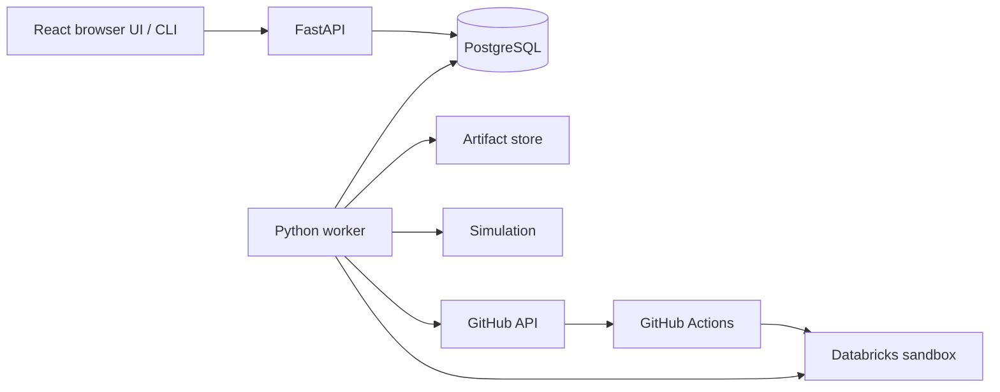

# Architecture

Status: target design. See [repository map](repository-map.md) for actual code.

## Processes and ownership

T04a implements React with Vite for development and nginx for static serving.
The browser uses a same-origin API proxy and HTTP-only cookie sessions; FastAPI
and the worker retain all authorization and workflow rules. Streamlit is retired
after browser parity verification. See ADR-015/016 for scope and session choices.

The worker-to-Databricks path supports status observation and permitted run
commands. Deployment execution belongs to the environment's selected executor:
simulation locally, GitHub Actions for the first real integration. Do not implement
a second direct-CLI deployment executor unless a later task needs it.

- API: authentication, authorization, input validation, transactionally persisted
  commands, PostgreSQL-backed read endpoints. No deployment credentials.
- Worker: durable claims, authorization rechecks, integration calls, observations,
  retries/reconciliation. Receives only credentials needed by selected adapters.
- GitHub runner: tests/builds and approved sandbox bundle execution; obtains its
  own restricted Databricks credentials. It cannot reach localhost on the developer's machine.
- PostgreSQL: registry, operation queue, policies, audit, observed external state.
- Artifact store: generated projects and captured manifests, never credentials.

Keep a modular monolith with shared Python services, not independently deployed
business microservices. Retain synchronous database sessions and use short-lived
transactions; never keep a database transaction open during a network/subprocess call.

## Command transaction

For deployment submission, validate the actor, binding, revision, approval, and
idempotency key; create deployment + operation + audit event; commit once; return
`202`. If any insert fails, none of those changes survive. Helpers may flush but
must not commit their own portion. Reserve the application/environment concurrency
slot atomically, using a database constraint or locked coordination row.

Queue payloads are versioned typed JSON containing identifiers and nonsecret
parameters, never executable Python callables. Introduce an outbox only if an
external message broker is actually introduced. GitHub dispatch still requires
reconciliation because its side effect cannot share the PostgreSQL transaction.

## Worker protocol

1. In a short transaction, atomically claim an eligible operation (for example,
   row locking with `SKIP LOCKED`), create an attempt, and assign worker ID,
   lease expiry, and monotonically increasing fencing token.
2. Recheck the current requester's execution eligibility, active application,
   valid binding, and exact approval. Capture the authorization decision in audit.
3. Persist a stable external correlation ID before submitting external work.
4. Execute without an open DB transaction. Heartbeat while owning the lease;
   persist external IDs immediately when received.
5. Commit observations/results only when worker ID, token, and unexpired lease
   still match. A stale worker cannot change operation or deployment state.
6. On expiry, reclaim and reconcile before repeating a possible side effect.

Fencing DB writes cannot cancel an already submitted external action. Provider
identifiers, provider idempotency where supported, and reconciliation must handle
that case. Never promise exactly-once execution.

Use a persistent application/environment reservation through external completion,
including `needs_attention`; a lease expiry alone must not free it. Initially
allow one active external operation per workspace as a conservative limit.
Permit unrelated local work concurrently and make limits configurable later.

## Failure and cancellation

- Known transient failure before submission: bounded backoff with jitter and a
  configured attempt limit (initial default: 3 attempts, 2-second base, 60-second cap).
- Authentication, authorization, invalid inputs, approval mismatch: terminal,
  sanitized diagnostic, no automatic retry.
- Uncertain submission: `reconciling`, query by correlation/external identifier.
  If uniqueness or nonexecution cannot be established, `needs_attention` and
  keep the conflict reservation. Do not blindly resubmit.
- Pending cancellation: cancel before execution. Running cancellation: record
  intent, request provider cancellation when possible, then observe the outcome.
  Success may win a cancellation race; cancellation is not rollback.
- Recovery: operator resolves uncertain state with evidence and an audit event.
  A retry is a new linked operation with renewed policy checks; an uncertain
  external action cannot be retried until reconciliation resolves it.

## Profiles and adapters

| Configuration | Local default | Sandbox | Organizational target |
|---|---|---|---|
| Runtime profile | `local` | `sandbox` | `organization` |
| Authentication | Explicit development accounts | Development permitted for single-admin demo | External identity required |
| Deployment executor | `simulated` | `github_actions` | Approved executor |
| Artifacts | Mounted local directory | Local plus GitHub-accessible source/artifacts | Shared storage |
| External credentials | None | Explicit worker/runner configuration | Scoped workload identities |

Construct adapters at startup from validated configuration. Reject unsupported
combinations, unsafe organization defaults, and unavailable required credentials.
Do not implement nominal organization mode that silently uses development auth.
Until its adapters exist, fail startup with a clear unsupported-profile error.

Implement narrow interfaces only when first needed: artifact put/get by digest;
executor submit/observe/cancel/reconcile; repository revision resolution and CI
observation; Databricks run submission/status. Simulation shares service contracts
but carries a mandatory `execution_mode=simulated` marker throughout records/UI.

Profile changes do not provision infrastructure or migrate data. Local artifacts
must be migrated before moving to another host; references cannot depend on an
API process's private filesystem.

### T03 implemented profile gate

`RUNTIME_PROFILE` defaults to `local`; `DEPLOYMENT_EXECUTOR=simulated` must be
configured explicitly, including for an existing local `.env`. T03 implements
only this combination. `local/github_actions` and `sandbox/simulated` fail as
mismatches; `sandbox/github_actions` fails until its integration is available.
All `organization` configurations fail because external identity is not implemented.
Settings error messages omit input values to avoid echoing credentials.

Environment records in T03 are simulated sandbox references, not live workspace
connections: `workspace_ref=simulated://<name>`, `allowed_executor=simulated`.
Registration, seeding, reads and policy changes perform no provider calls. The
later sandbox-runtime gate is distinct from naming a local simulated environment
"sandbox". T03 introduces no nominal deployment adapter or execution worker.

Environment and binding mutations lock the environment row first. Environment
edits increment all associated binding versions and audit the policy change in
each affected application's history atomically. Future revision preparation must
capture binding and environment versions/config/policy; execution must recheck
current enabled state, approved target, versions and actor permissions. A GET's
`usable` flag describes current recorded eligibility, not an execution guarantee.

## Observability and lifecycle

Use structured logs with request, operation, attempt, and actor identifiers;
sanitize integration errors and avoid SQL parameter logging by default. Audit is
transactional business history, distinct from debug logs. Application endpoints
cannot edit/delete audit rows; this is not yet tamper-proof storage against DB admins.

Separate liveness from DB readiness. Track queue age, operation duration,
attempts/retries, stale leases, and last observation time. Archived applications
retain revision/deployment/audit history and external data. Reject archive while a
conflicting operation is unresolved; require explicit separate retirement work for
external resources in a future phase.

### T04 implemented worker slice

`worker.py` is a separate PostgreSQL polling process, also included in Compose.
`services/queue_service.py` owns claims, short lease/heartbeat/result transactions
and fencing; `services/operation_service.py` owns user commands, authorization,
reservation and idempotency/audit transactions. The worker has explicit typed
probe dispatch and no provider or arbitrary-code execution path. Worker loss
enters reconciliation; a fixed probe can establish safe repeat execution because
it has no external side effects. An unknown probe retains its reservation.

API liveness is independent from readiness. Readiness requires queue access and
recent worker presence; admin telemetry describes queue age/counts/expired leases.
Neither heartbeat freshness nor local simulation asserts provider readiness.
Future T05 handlers must extend the closed dispatch/schema and fenced related
result transaction without executing adopted repository code in this worker.
